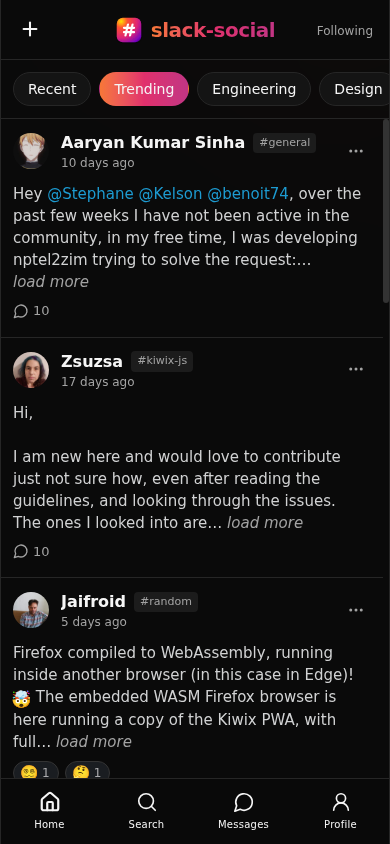
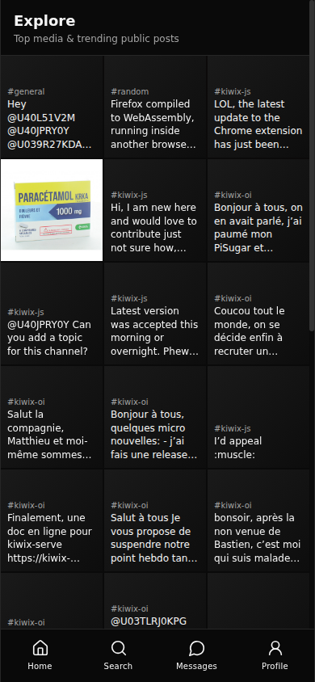
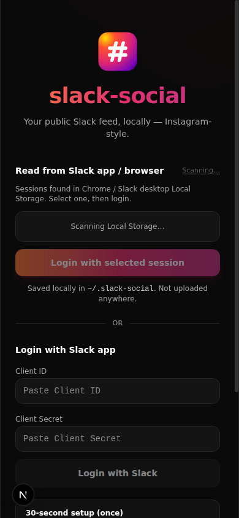

<div align="center">


# slack-social

### Make work fun. Find friends on Slack.

<br />


<br /><br />

**Your workspace already has the good stuff —**  
wins, memes, shoutouts, late-night ideas, the people you’d actually grab coffee with.

**slack-social** turns public Slack into a beautiful social feed.  
Follow coworkers. Explore what’s popping. React like it’s Instagram.  
Work feels less like inbox zero — and more like hanging out.

<br />

<p>
  <a href="https://yash1ts.github.io/slack-social/"><strong>Live showcase →</strong></a>
  ·
  <a href="https://www.npmjs.com/package/slack-social">npm</a>
</p>

<br />


&nbsp;

&nbsp;


<br />

</div>

---

### Why you’ll love it

**A real feed** · Trending posts from public channels, ranked for what’s actually worth your attention.

**Find your people** · Profiles, follows, and the humans behind the handles — not just another `#general` scroll.

**Explore the vibes** · Top media and public posts in a glanceable grid.

**Stays on your machine** · Indexed locally. Your data. Your laptop. Zero cloud drama.

---

### Slack vs slack-social

| Slack app | slack-social |
|-----------|--------------|
| Channel-first chat | Feed-first social browsing |
| Easy to miss culture posts | Trending + Explore surfaces gems |
| Hard to notice new people | Profiles & follows |
| Feels like an inbox | Feels like hanging out |

---

### Ready to hang?

Requires [Bun](https://bun.sh).

Try it instantly with dummy data (no Slack login):

```bash
npx slack-social demo
```

Or connect your workspace:

```bash
npx slack-social serve
```

Open [localhost:3000](http://localhost:3000) → **start scrolling.**

---

### FAQ

**What is slack-social?**  
An open-source local app that indexes public Slack activity into SQLite and serves an Instagram-style feed on your machine — so you can make work fun and find friends on Slack.

**Is my data uploaded anywhere?**  
No. Posts, media, and credentials live under `~/.slack-social`. The app does not store your workspace in a third-party cloud.

**Who is it for?**  
Teams and communities that live in Slack and want a friendlier way to discover people, wins, and culture across public channels.

---

### Contribute

This is an open-source project — **you’re invited to build with us.**

Fork the repo, check it out, run it locally, and open a PR. Docs, bugs, UI polish, and bigger ideas all help.

```bash
git clone https://github.com/yash1ts/slack-social.git
cd slack-social
bun install
bun run slack-social serve
```

Read **[CONTRIBUTING.md](./CONTRIBUTING.md)** for setup, project layout, and how we review PRs.  
By contributing, you agree your work is licensed under **[GPL-3.0](./LICENSE)**.

---

<div align="center">

<p>
  
  
  
</p>

<sub>Open source · GPLv3 · Built for humans who live in Slack · <a href="CONTRIBUTING.md">Contribute</a> · <a href="llms.txt">llms.txt</a> · <a href="https://yash1ts.github.io/slack-social/">Showcase</a></sub>

</div>
